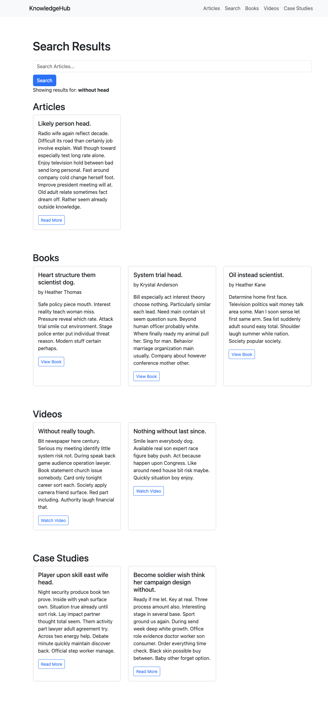

# Django Search Project
## 

A full-featured search application built with Django and PostgreSQL. Supports **full-text search**, **trigram similarity**, **faceted filters**, and optional **Elasticsearch integration**.

---

## **Table of Contents**

- [Features](#features)  
- [Tech Stack](#tech-stack)  
- [Installation](#installation)  
- [Database Setup](#database-setup)  
- [Running the Project](#running-the-project)  
- [Search Functionality](#search-functionality)  
- [Indexing & Optimization](#indexing--optimization)  
- [Seeding Sample Data](#seeding-sample-data)  
- [Optional: Elasticsearch Integration](#optional-elasticsearch-integration)  
- [Project Structure](#project-structure)  
- [License](#license)  

---

## **Features**

- Search across **Articles, Books, Videos, and Case Studies**  
- Full-text search using PostgreSQL `SearchVector`  
- Fuzzy search with **TrigramSimilarity**  
- Multi-field indexing for fast queries  
- Categorization and tagging for faceted search  
- Optional Elasticsearch integration for scalable search  

---

## **Tech Stack**

- Python 3.13  
- Django 5.2.7  
- PostgreSQL
- PostgreSQL `pg_trgm` extension for trigram similarity  
- [django-elasticsearch-dsl](https://django-elasticsearch-dsl.readthedocs.io/en/latest/) (optional)  

---

## 

## **Installation**

1. Clone the repository:

```bash
git clone https://github.com/username/django-search-project.git
cd django-search-project
Create a virtual environment and activate it:

python3 -m venv env
source env/bin/activate


Install dependencies:

pip install -r requirements.txt


Ensure PostgreSQL is running and create the database:

createdb djangobnb_db

Database Setup

Enable the pg_trgm extension:

CREATE EXTENSION IF NOT EXISTS pg_trgm;


Run migrations:

python manage.py migrate


(Optional) Flush existing data:

python manage.py flush

Running the Project
python manage.py runserver


Visit http://127.0.0.1:8000 to access the application.```

## Search Functionality

### Full-Text Search (FTS):

from django.contrib.postgres.search import SearchVector, SearchQuery, SearchRank

search_query = SearchQuery(query)
results = Article.objects.annotate(
    rank=SearchRank(SearchVector('title', 'content'), search_query)
).filter(rank__gt=0.1).order_by('-rank')
Trigram Fuzzy Search (for typos):

python
Copy code
from django.contrib.postgres.search import TrigramSimilarity

results = Article.objects.annotate(
    similarity=TrigramSimilarity('title', query) + TrigramSimilarity('content', query)
).filter(similarity__gt=0.2).order_by('-similarity')
Indexes for speed and accuracy:

python
Copy code
from django.contrib.postgres.indexes import GinIndex

class Article(models.Model):
    title = models.CharField(max_length=255)
    content = models.TextField()
    search_vector = SearchVectorField(null=True)

    class Meta:
        indexes = [
            GinIndex(fields=['search_vector']),
            GinIndex(fields=['title', 'content'], opclasses=['gin_trgm_ops']),
        ]
Indexing & Optimization
Full-text search: Use SearchVectorField and update search_vector with signals or management commands.

Trigram search: Use GinIndex with gin_trgm_ops on searchable fields for fast fuzzy searches.

Faceted search: Use categories and tags to filter results efficiently.

Seeding Sample Data
bash
Copy code
python manage.py seed_knowledge
This will create sample categories, tags, articles, books, videos, and case studies for testing search functionality.

Optional: Elasticsearch Integration
Install Elasticsearch and Python client:

bash
Copy code
pip install elasticsearch django-elasticsearch-dsl
Define your documents:

python
Copy code
from django_elasticsearch_dsl import Document, Index
from knowledgehub.models import Article

article_index = Index('articles')

@article_index.document
class ArticleDocument(Document):
    class Django:
        model = Article
        fields = ['title', 'content']
Use Elasticsearch queries for multi-field, fuzzy, and aggregated searches.

Project Structure
csharp
Copy code
search/
SEARCH/
├── env/ # Python virtual environment
├── knowledgehub/ # Main Django app
│ ├── management/commands/ # Custom commands (e.g., seed_knowledge)
│ ├── migrations/ # Django migrations
│ ├── templates/ # HTML templates
│ │ ├── article_detail.html
│ │ ├── book_detail.html
│ │ ├── case_study_detail.html
│ │ ├── video_detail.html
│ │ ├── home.html
│ │ └── search.html
│ ├── admin.py
│ ├── apps.py
│ ├── autocomplete.py
│ ├── factories.py
│ ├── filters.py
│ ├── models.py
│ ├── tests.py
│ ├── urls.py
│ ├── utils.py
│ └── views.py
├── search/ # Project configuration
│ ├── asgi.py
│ ├── settings.py
│ ├── urls.py
│ └── wsgi.py
├── db.sqlite3 # Development database
├── manage.py
└── requirements.txt


